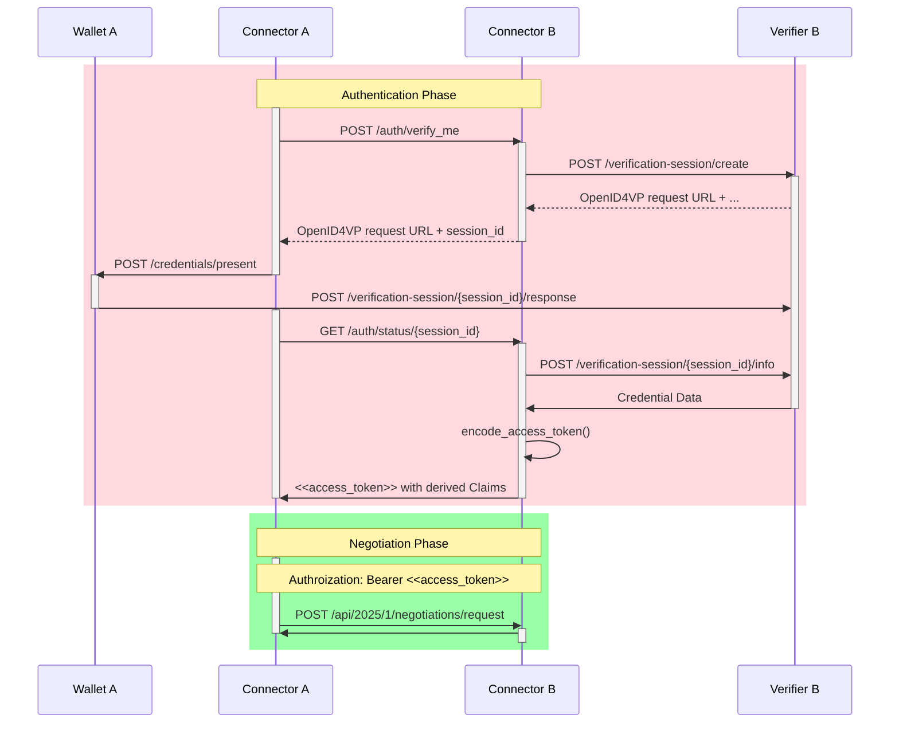

# Proprietary authentication protocol

The sequence diagram below illustrates our proprietary authentication protocol — a protocol based on OpenID4VP that
shares similarities with the [Dataspace Claims Protocol](https://eclipse-dataspace-dcp.github.io/decentralized-claims-protocol/v1.0.1/).

